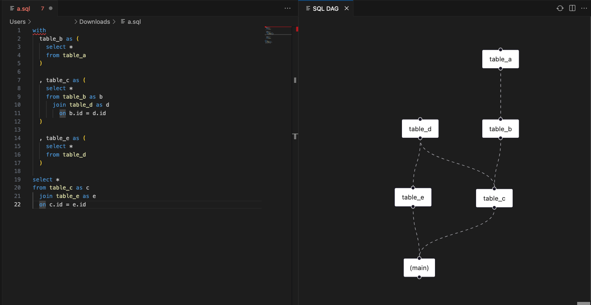

# VSCode SQL DAG Viewer

A VSCode extension to preview the DAG of CTEs in a SQL.

# Quickstart

Open a SQL file.

`⌘ + Shift + P` → `SQL DAG Viewer: Preview DAG`

# Dependencies

- TypeScript
- React
- Vite
- SQL parser: https://github.com/nene/sql-parser-cst
- DAG layouting: https://github.com/dagrejs/dagre
- DAG viewer: https://reactflow.dev/